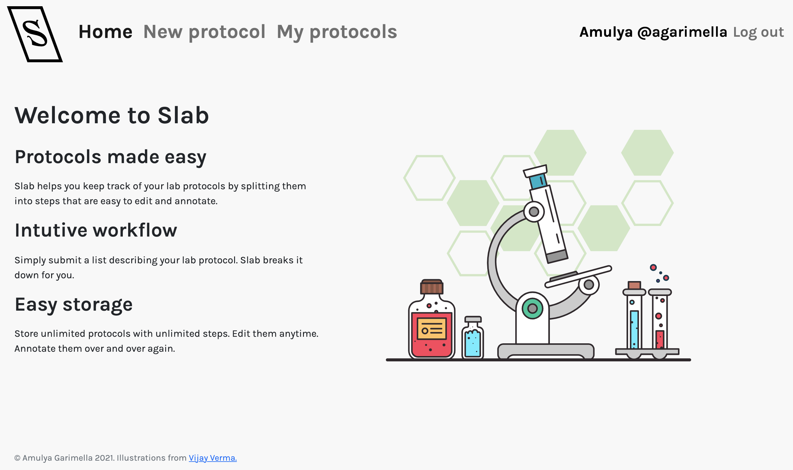
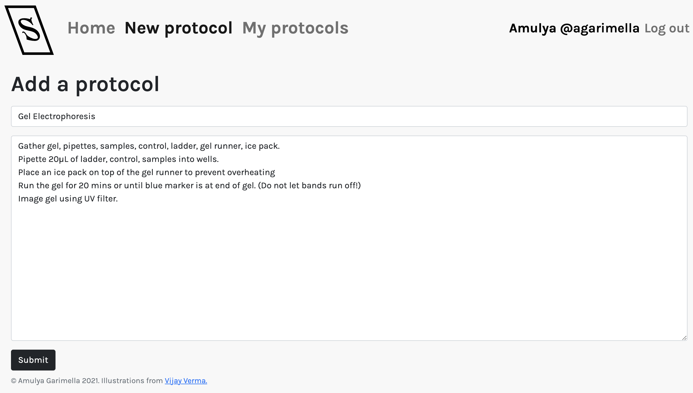
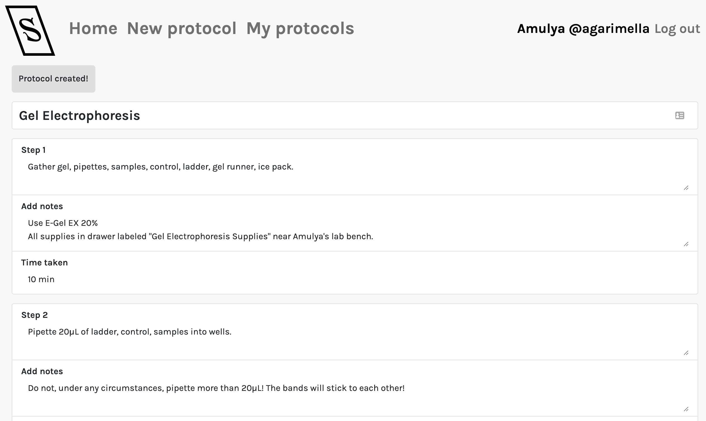
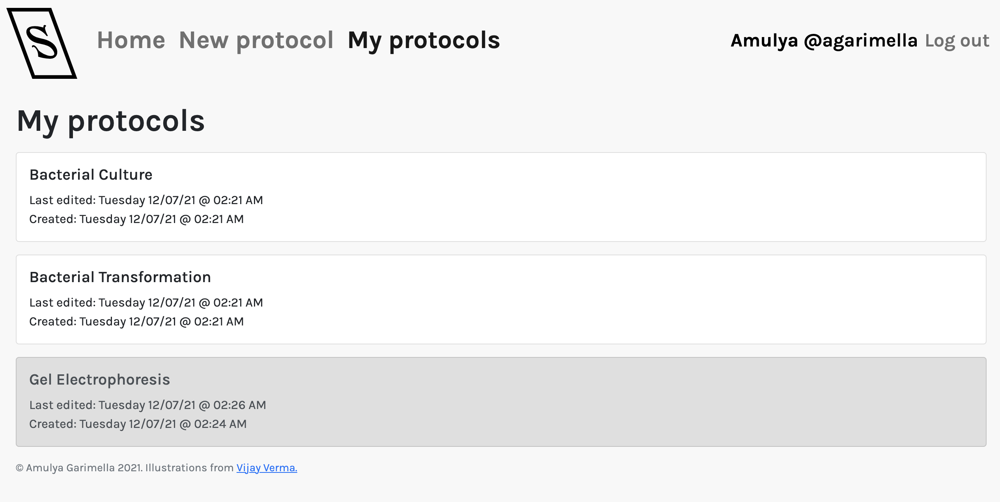

# Slab: Better Lab Notes

## Introduction
Slab is a web app that'll help you keep track of your lab protocols. Slab's workflow looks like this: first, submit a list describing your lab protocol. Slab will break down the protocol into individual steps. Then, each time you use a protocol, edit and make notes on it!

## Video
[See Slab in action here.](https://youtu.be/2kuf4lVb_9A)

## App structure overview
* `slab/`
    * `README.md` Getting started and using Slab. You are here!📍
    * `DESIGN.md` Design doc.
    * `app.py` Main app routes: login/logout, registration, protocol creation, protocol editing, protocol viewing, error handling.
    * `helpers.py` Helper functions: one to flash form errors and one to be used as a Jinja filter to display times in user's local timezone.
    * `models.py` Objects that represent tables in our database.
    * `forms.py` Various forms we use in the app: login, registration, protocol creation, protocol editing.
    * `static/`
        * `main.css` CSS styling for the app.
        * `slab.svg` Our logo.
        * `gummy-macbook.svg` `gummy-medical-lab.svg` `gummy-sweet-home.svg` Vector illustrations by Vijay Verma.
    * `templates/`
        * `base.html` Base page template.
        * `edit.html` Protocol editing form.
        * `index.html` Main page.
        * `login.html` Login page.
        * `new.html` New protocol creation page.
        * `protocols.html` Contains all of a user's protocols.
        * `register.html` Registration page.

## Tech
* Frontend: HTML, CSS, Jinja
* Backend: Python, Flask
* Database: SQLAlchemy
* Frameworks used: Bootstrap (frontend), Flask-SQLAlchemy, Flask-Login, WTForms (backend)

## Getting started
1. Clone this repository (or download zip file)
```
git clone https://github.com/amulyagarimella/slab.git
```
2. Go to the app directory
```
cd path/to/slab
```
3. Create and activate your virtual environment (optional but recommended!)
    * macOS/Linux: 
    ```
    python3 -m venv venv
    . venv/bin/activate
    ```
    * Windows (not tested):
    ```
    py -3 -m venv venv
    venv\Scripts\activate
    ```

If this works, your command line should now have `(venv)` in front of each line.

4. Install the app requirements
```
pip install -r requirements.txt
```
5. Run the app!
```
export FLASK_APP=app
python3 -m flask run
```

## Using Slab
1. Sign up for an account! Go to the Registration tab and enter your info. Then, log into your account.
2. Create a protocol. Clicking on New Protocol, add a protocol by entering a title, along with each step of the protocol on a new line. Edit the protocol to your heart's content, then save it.
3. You can view your protocols at any time by clicking on My Protocols.
4. Anytime you need to perform a protocol, create it, then access the stored protocol. As you complete each task, make note of any important information for future reference.

## Slab Screenshots



